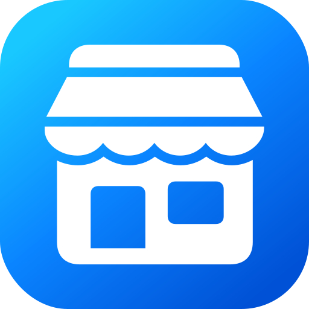

# ASC Marketing Manager

<p align="center">
  
</p>

[](LICENSE)
[](https://skills.sh/superturboryan/asc-marketing-manager/asc-marketing-manager)


ASC Marketing Manager is a Codex marketplace plugin for dry-running and syncing App Store Connect
marketing metadata, App Review details, and localized screenshot assets.

It is built around a simple release-manager rule: compare first, apply only after review. The
bundled scripts are dependency-free Node programs that read local desired-state files, talk directly
to App Store Connect, and keep Google Sheets access on the Codex connector side.

## Install

Add this repository as a Codex marketplace source:

```zsh
codex plugin marketplace add superturboryan/asc-marketing-manager
```

Then install or browse **ASC Marketing Manager** from that marketplace. Start a workflow in a new
Codex thread with:

```text
/asc-marketing-manager
```

Other supported install paths:

```zsh
npx skills add superturboryan/asc-marketing-manager
npx codex-marketplace add superturboryan/asc-marketing-manager --plugins
```

## What It Handles

- localized app name, subtitle, description, keywords, support URL, and marketing URL
- `whatsNew` and `promotionalText`
- App Review contact, demo account, and notes fields
- explicit creation of a missing editable App Store version with `--ensure-version`
- localized App Store screenshot replacement from nested local folders
- Google Sheets connector workflows and desired-state JSON workflows

App previews, build selection, review attachments, submission, phased release, routing coverage, and
rating reset are future scope. App previews should remain a separate workflow because ASC video
assets have different validation and processing failure modes.

## Workflow

1. Confirm the app, credential env file, and target App Store version.
2. Build desired-state JSON from a Google Sheet or a checked local JSON file.
3. Run the matching script with `--dry-run`.
4. Review the diff and warnings.
5. Run `--apply` only when the dry run is clean and the user explicitly approves.

The skill writes transient generated JSON to `/private/tmp` and avoids committing unreleased copy or
credentials.

## Google Sheets

When `ASC_SHEET_ID` points to a spreadsheet, Codex reads it through the Google Sheets connector and
uses the bundled mapper to produce desired JSON. If a sheet is missing, the skill can create a blank
native Google Sheet, then stop until the user fills and reviews the copy.

The default sheet layout is:

- a `Pages` tab for storefront reference URLs
- one version tab named from `ASC_SHEET_NAME` or the confirmed target version
- version-tab headers: version label, `Name`, `Subtitle`, `Promotional Text`, `Description`,
  `What's new`, `Keywords`
- optional `supportUrl` and `marketingUrl` columns after `Keywords`
- `Reviewer Notes` below the localization table

Templates live in
`plugins/asc-marketing-manager/skills/asc-marketing-manager/assets/examples/`. Full sheet creation
and extraction rules are in
`plugins/asc-marketing-manager/skills/asc-marketing-manager/references/google-sheet-localizations.md`.

## Screenshot Assets

Use `asc-sync-assets.mjs` for screenshots. Each screenshot path must contain one ASC locale and one
screenshot display type. Leading filename numbers define order.

```text
AppStoreScreenshots/
  en-US/
    APP_IPHONE_67/
      01-home.png
      02-search.png
  APP_IPHONE_67/
    ja/
      01-home.png
      02-search.png
```

Apply mode replaces each targeted ASC screenshot set with the matching local files. Folder rules are
documented in
`plugins/asc-marketing-manager/skills/asc-marketing-manager/references/asset-folder-screenshots.md`.

## Commands

Metadata dry run:

```zsh
node plugins/asc-marketing-manager/skills/asc-marketing-manager/scripts/asc-sync-metadata.mjs \
  --env ~/.appstoreconnect/my-app.env \
  --desired /private/tmp/asc-desired-metadata.json \
  --version 2.3.0 \
  --dry-run
```

Create a missing editable version during the dry run:

```zsh
node plugins/asc-marketing-manager/skills/asc-marketing-manager/scripts/asc-sync-metadata.mjs \
  --env ~/.appstoreconnect/my-app.env \
  --desired /private/tmp/asc-desired-metadata.json \
  --version 2.3.0 \
  --ensure-version \
  --dry-run
```

Screenshot dry run:

```zsh
node plugins/asc-marketing-manager/skills/asc-marketing-manager/scripts/asc-sync-assets.mjs \
  --env ~/.appstoreconnect/my-app.env \
  --assets ./AppStoreScreenshots \
  --version 2.3.0 \
  --dry-run
```

Replace `--dry-run` with `--apply` only after reviewing a clean dry run.

## Credentials

Create an App Store Connect Team API key with the least privilege role that supports the workflow.
For the current metadata and screenshot scope, **Marketing** should be sufficient.

Store credentials outside the repository:

```zsh
mkdir -p ~/.appstoreconnect
chmod 700 ~/.appstoreconnect
chmod 600 ~/.appstoreconnect/*.env
chmod 600 ~/.appstoreconnect/*.p8
```

Required env values:

```zsh
ASC_KEY_ID=<KEY_ID>
ASC_ISSUER_ID=<ISSUER_ID>
ASC_KEY_PATH=/Users/you/.appstoreconnect/AuthKey_<KEY_ID>.p8
ASC_APP_ID=<APP_ID>
ASC_PLATFORM=IOS
ASC_COPYRIGHT=2026 Your Name
ASC_SHEET_ID=<GOOGLE_SHEET_ID>
ASC_SHEET_NAME=<SHEET_TAB_NAME>
```

Keep the target App Store version out of shared credential files. Provide it with `--version` or in
desired JSON as `version.versionString`.

## Desired JSON

The nested desired-state shape separates App Info, App Store Version localization, version
attributes, and App Review details:

```json
{
  "appInfo": {
    "locales": {
      "en-US": {
        "name": "Example App",
        "subtitle": "Music on your watch"
      }
    }
  },
  "version": {
    "versionString": "2.3.0",
    "platform": "IOS",
    "copyright": "2026 Example",
    "releaseType": "MANUAL",
    "usesIdfa": false,
    "locales": {
      "en-US": {
        "promotionalText": "Short promotional text, max 170 characters.",
        "description": "Long App Store description.",
        "keywords": "music,watch,streaming",
        "supportUrl": "https://example.com/support",
        "marketingUrl": "https://example.com",
        "whatsNew": "+ Release note one\n+ Release note two"
      }
    }
  }
}
```

See
`plugins/asc-marketing-manager/skills/asc-marketing-manager/references/desired-json-schema.md`
for the full schema, field limits, fallback rules, and App Review fields.

## Safety Model

- dry-run-first for metadata and screenshots
- exact locale matching and locale fallback validation
- character and UTF-8 byte limit validation
- URL validation for support and marketing URLs
- blank-field rejection and trailing whitespace normalization
- redaction for credentials, JWTs, review passwords, and env contents
- screenshot folder ambiguity checks before replace-set applies

## Tests

Run the dependency-free test suite with Node's built-in test runner:

```zsh
node --test plugins/asc-marketing-manager/skills/asc-marketing-manager/tests/*.test.mjs
```

Tests do not call App Store Connect and do not require real credentials.

## Contributing

Contributions are welcome where they make App Store Connect releases safer, clearer, or easier to
review. Good areas include validation fixtures, clearer sheet extraction rules, dry-run summaries,
editable-version edge cases, screenshot display aliases, and common release-manager workflows.
